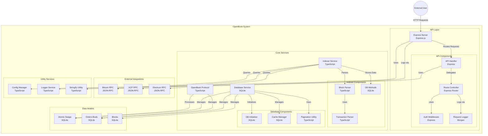

# BTC_OPENBOOK

# ABSTRACT

Openbook is a system that allows marketplace and service providers to share a common atomic swaps orderbook across platforms using onchain listings.
This systems aims to be an standarized way to transact with atomic swaps, initially using Counterparty (Protocol 0) as the underlying protocol but extensible to other protocols like Ordinals or Runes.

# GETTING STARTED

1. Ensure you have deno installed, if you dont have it you can install it running the following command:

```bash
curl -fsSL https://deno.land/install.sh | sh
```

2. Clone the repository and create a new file called `.env` with the env vars included in `.sample.env`:

3. Run the following command to start the server:

```bash
deno task start
```

# SYSTEM ARCHITECTURE



