# BTC_OPENBOOK

# ABSTRACT

Openbook is a system that allows marketplace and service providers to share a common atomic swaps orderbook across platforms using onchain listings.
This systems aims to be an standarized way to transact with atomic swaps, initially using Counterparty (Protocol 0) as the underlying protocol but extensible to other protocols like Ordinals or Runes.

# GETTING STARTED

1. Ensure you have deno installed, if you dont have it you can install it running the following command:

```bash
curl -fsSL https://deno.land/install.sh | sh
```

2. Clone the repository and create a new file called `.env` with the env vars included in `.sample.env`:

3. Run the following command to start the server:

```bash
deno task start
```

# ONCHAIN TRANSACTIONS FORMAT
The way the listing transactions encodes the listing data to be stored in bitcoin follows the next logic:

The required things to be able to recreate the listing PSBT transaction are the following four things:
1.- The utxo that contains the asset to b listed.
2.- The price of the asset in satoshis.
4.- The signature of the original PSBT signed by the seller

As the OP_RETURN is a 80 bytes field we need to encode the data in 2 ways.
1.- We use the OP_RETURN to store the price and the UTXO that contains the asset to be listed.
2.- we use the OLGA encoding using P2WSH to store the signature of the original PSBT signed by the seller.

The indexer will be able to decode the listing transaction and reconstruct the original PSBT, store it on a SQLite DB and use it to create the atomic swap.

```mermaid
graph TB
    subgraph Listing Transaction
        A[Listing Transacción nLockTime 888]
        A --> B[Inputs]
        A --> C[Outputs]
    end

    %% Outputs
    subgraph Outputs
        C1[PartialSig 1 - P2WSH]
        C2[PartialSig 2 - P2WSH]
        C3[PartialSig 3 - P2WSH]
        C4[UTXO + Price - OP_RETURN]
        C4[Change]
        C --> C1
        C --> C2
        C --> C3
        C --> C4
    end

    %% Inputs
    subgraph Inputs
        B1[UTXO To pay miner fees]
        B --> B1
    end
```



# SYSTEM ARCHITECTURE


